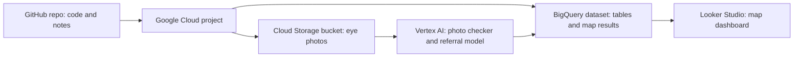

# Closing the Diabetic Eye Screening Gap

Work in progress. I'm building this in 7 parts, and this page gets filled in as I go.

## The short version

<!-- Fill in at the end, in 3 or 4 plain sentences. No tech words. -->
<!-- Say what the problem is, what I found, and what I'd recommend. -->
[To be written once the results are in.]

## What is real and what is simulated

This is a portfolio project built on public data. It is not a medical tool, and it should never be used to make decisions about real patients.

The eye photos and the area-level diabetes numbers come from real public sources. The patient locations are simulated, meaning I made them up by following real patterns. Anything on the map that connects a photo to a place is an illustration of how the idea would work, not a finding about real people.

## The problem

People with diabetes are supposed to get an eye exam every year, because diabetes can quietly damage the eye and cause vision loss. Many skip it. Two reasons I'm looking at: the screening site is far away, and sometimes the photo of the eye comes out unusable, so the patient has to come back.

## What this project does

<!-- Fill in after Part 4. One paragraph on the photo checker and the referral model. -->
<!-- Fill in after Part 5. One paragraph on the map analysis. -->

## How it fits together

## Results

<!-- Fill in after Parts 4, 5 and 6 with real numbers and screenshots. -->

## What went wrong and what I changed

<!-- Fill in as things break. Real examples only. -->

## Who would need to approve this before real use

<!-- Fill in during Part 7. -->

## Where this kind of thinking shows up outside healthcare

<!-- Fill in during Part 7. -->

## Limitations

<!-- Fill in during Part 7. Be plain about what this can't tell you. -->

## Data sources and licenses

<!-- Fill in during Part 2. Every dataset, where it came from, and its license. -->

## How to run this

<!-- Fill in during Part 7, step by step, so a stranger could follow it. -->

## Cost

The running total is in COST_LOG.md.

## How I made my choices

Every decision, with the options I looked at and why I picked what I did, is in DECISIONS.md. It's written in plain language on purpose.
